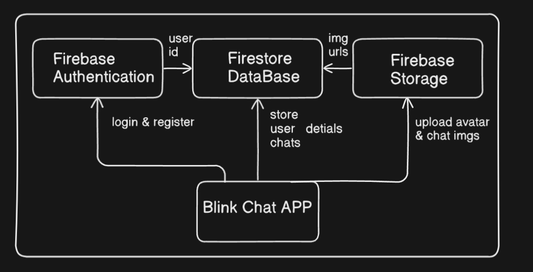
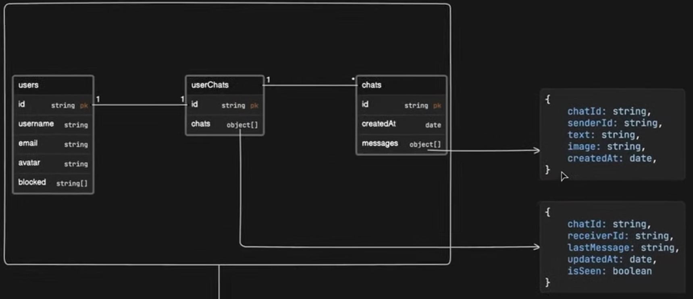

🟣 BlinkChat – Real-Time Chat App with React & Firebase

BlinkChat is a modern real-time chat application built with React.js and Firebase.
It enables users to send and receive messages instantly with a smooth, responsive UI and live synchronization across devices.

🚀 Features

💬 Real-time messaging using Firebase Firestore

🔐 User authentication (Sign up / Sign in with Firebase Auth)

🧑‍🤝‍🧑 One-to-one and group chats

🌙 Light & dark mode support

📱 Responsive design (works on mobile & desktop)

🪄 Clean and modern UI built with React

🛠️ Tech Stack

Frontend: React.js, CSS / Tailwind CSS

Backend: Firebase (Auth, Firestore, Storage)

State Management: React Hooks / Context API

                ┌──────────────────────────┐
                │       User Opens App     │
                └─────────────┬────────────┘
                              │
                              ▼
              ┌─────────────────────────────┐
              │  Check Authentication State │
              │ Firebase Authentication     │
              └─────────────┬───────────────┘
                      ┌─────┴─────┐
          ┌───────────▼────────────▼───────────┐
          │                                    │
┌──────────────────────┐           ┌──────────────────────┐
│User NOT Authenticated│           │User IS Authenticated │
└──────────┬───────────┘           └──────────┬───────────┘
           │                                  │
           ▼                                  ▼
┌──────────────────────┐          ┌────────────────────────┐
│ Login / Register Page│          │  Chat Page (Firestore) │
└──────────┬───────────┘          └──────────┬─────────────┘
           │                                 │
           ▼                                 ▼
 ┌──────────────────────┐         ┌────────────────────────┐
 │ Firebase Auth creates│         │ User selects a chat or │
 │ user & stores profile│         │ starts new conversation│
 └──────────┬───────────┘         └──────────┬─────────────┘
            │                                │
            ▼                                ▼
   ┌──────────────────────┐         ┌────────────────────────┐
   │ Redirect to Dashboard│         │Send Message → Firestore│
   └──────────┬───────────┘         └──────────┬─────────────┘
              │                                │
              ▼                                ▼
      ┌────────────────────┐           ┌───────────────────────┐
      │ Realtime Firestore │◄──────────┤ Message stored in DB  │
      │ listener updates UI│           └───────────────────────┘
      └──────────┬─────────┘
                 │
                 ▼
       ┌─────────────────────────┐
       │Messages appear instantly│
       │to both sender & receiver│
       └─────────────────────────┘

